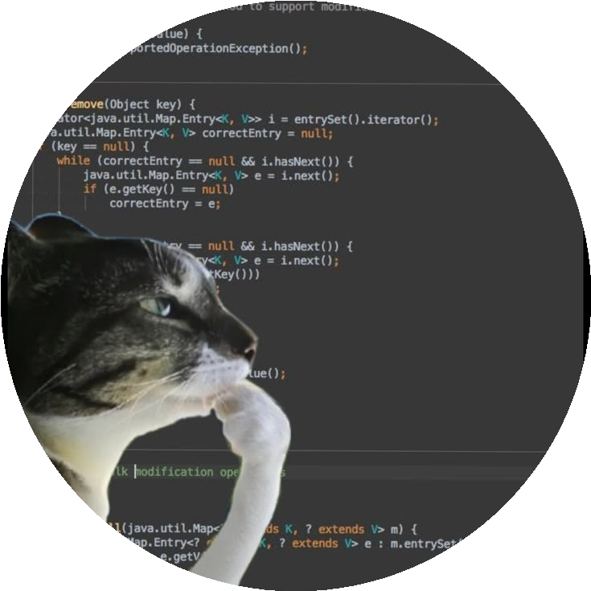

  <!-- Header Meme / Banner (Circular Frame) -->
  

  <!-- for beauty -->
  
&nbsp;

<!-- Welcome words -->
<h1 style="color: #FFC0CB;">Welcome to Yashwanth's GitHub 🤧</h1>

🚀 **AI Developer | Software Engineer | Systems Architect**  

B.Tech CSE (AI & ML) graduate with expertise in full-stack development, multi-modal artificial intelligence, and scalable microservices.
Demonstrated expertise in engineering deterministic knowledge extraction engines, agentic RAG architectures, and biomedical intelligence platforms.
Skilled in Python, Java, JavaScript, TypeScript, C/C++, Dart, and modern frameworks including PyTorch, FastAPI, Spring Boot, LangChain, and Docker.

---

## 🔭 What I’m Working On
🤖 AI Projects: Multi-modal document chunking, self-corrective Agentic RAG, voice-assisted coding agents  
🌐 Web Development: High-performance microservices, responsive UIs with FastAPI, Flask & Spring Boot  
⚡ Data Platforms: Biomedical literature intelligence, automated PDF data extraction & Excel reporting  
🔌 Backend Systems: Enterprise REST APIs with strict RBAC, JWT auth, and concurrency control  

---

<h1>🌟 Featured Projects</h1>

## 🤖 AI-Powered Automation & Agents
**[OmniChunk](https://github.com/Nitro-Builds-Yash/OmniChunk)**  
  Universal multi-modal chunking, relational structure extraction, and context-preserving knowledge engine with zero information loss.

**[halo](https://github.com/Nitro-Builds-Yash/halo)**  
  A production-ready self-corrective QA assistant where users upload PDFs and perform deep multi-document reasoning with confidence scores and citation verification.

## 🧠 AI & Developer Tooling
**[voxcode](https://github.com/Nitro-Builds-Yash/voxcode)**  
  Voice-assisted AI coding agent combining AST symbol extraction, BM25 + dense hybrid search, planning, live diffing, and STT/TTS.  

##
## 🌐 Web & Data Platforms
[**Pulsus-MedScout**](https://github.com/Nitro-Builds-Yash/Pulsus-MedScout)  
  Biomedical Literature & Author Intelligence Platform across 34 repositories with search filters, automated PDF contact extraction, and Excel export.  
  
[**Crypto-Currency-Simulation**](https://github.com/Nitro-Builds-Yash/Crypto-Currency-Simulation-main)  
  A streamlined and secure backend model for cryptocurrency transactions, demonstrating Mongoose schema design and data relationships.  
  
[**resource-booking-api**](https://github.com/exelynt-learning-platform/backend-developer-as-final-71072-athota)  
  High-throughput Spring Boot REST API with strict RBAC, JWT authentication, and pessimistic concurrency locking.  

---

## 🌱 Currently Learning
Advanced **Multi-Agent Orchestration** & asynchronous consensus  
**FastAPI & uv** for low-latency scalable AI API backends  
**Graph RAG & Neo4j** knowledge graphs for complex document reasoning  

---

## 🤝 Open to Collaborate On
**AI Research & Agent Projects** (NLP, Multimodal, RAG)  
**Open-source developer utilities & tools**  
**High-concurrency backend services & cloud architecture**  

---

## 📫 Reach Me At
 📧 Email: **yashwanthchowdhury749@gmail.com**  
 💻 GitHub: [github.com/Nitro-Builds-Yash](https://github.com/Nitro-Builds-Yash)  
 💼 LinkedIn: [linkedin.com/in/athota-yashwanth](https://linkedin.com/in/athota-yashwanth)  

---

## ⚡ Fun Fact
I love breaking complex, chaotic engineering problems down into clean deterministic state machines and AI agents — turning unstructured data into verified knowledge! Curiosity is my superpower!  

---

## 📊 GitHub Stats
  

---

  

<!--
✨ This repository is special because its `README.md` appears on your GitHub profile.  
-->

